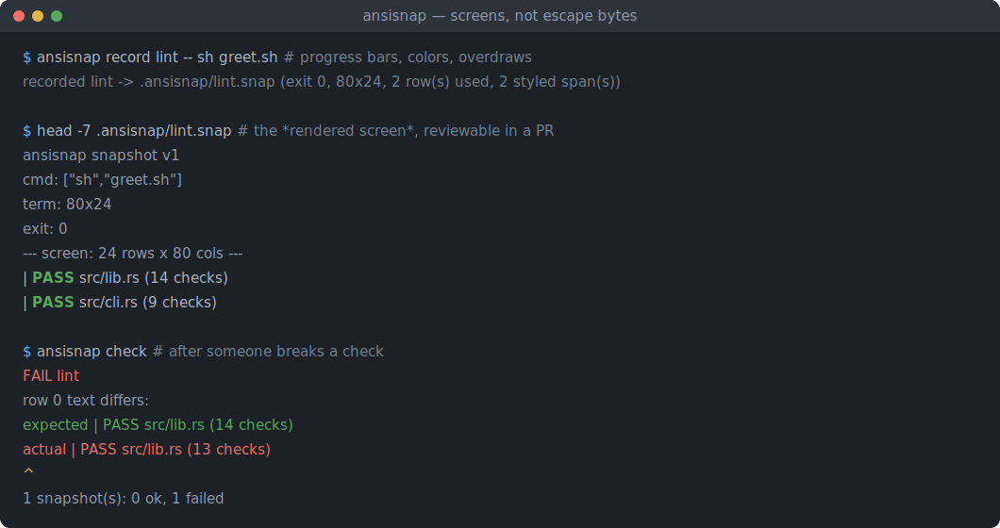

# ansisnap

[English](README.md) | [中文](README.zh.md) | [日本語](README.ja.md)

[](LICENSE) [](Cargo.toml) [](CHANGELOG.md)  [](CONTRIBUTING.md)

**ansisnap：an open-source snapshot-testing tool for CLI and TUI output — a built-in terminal emulator compares rendered screen grids, not raw ANSI bytes.**



```bash
git clone https://github.com/JaydenCJ/ansisnap.git && cargo install --path ansisnap
```

> Pre-release: v0.1.0 is not yet published to crates.io; install from source as above. A single binary with zero runtime dependencies — the escape parser, emulator, snapshot format and differ are all Rust stdlib.

## Why ansisnap?

Terminal UIs are having a renaissance — ratatui, bubbletea, textual — and their output tests are quietly miserable. A TUI frame is not text: it is a byte stream of cursor jumps, erase-lines, `\r` overdraws and SGR color churn, and any snapshot tool that compares those bytes fails on every cosmetic refactor. Reordering `ESC[1;31m` into `ESC[31;1m`, repainting a line instead of appending, a progress bar ticking 57% instead of 58% mid-capture — all byte-different, all visually identical, all red in CI. The usual fix is to strip ANSI codes before snapshotting, which throws away exactly what a TUI test should assert: *where* things are on screen and *what color* they are. ansisnap ends the false dichotomy by shipping a real terminal emulator: it runs your command, plays the byte stream into an 80×24 (or any) cell grid the way xterm would — cursor addressing, scroll regions, wide CJK characters, the alternate screen — and snapshots the final rendered grid plus its styles as a reviewable text file. A failing check tells you "row 4: expected `14 checks`, got `13 checks`" with a caret under the column, or "row 0: text identical, bold green became red" — never a wall of escape bytes.

| | ansisnap | insta / insta-cmd | Jest snapshots | hand-rolled golden files |
| --- | --- | --- | --- | --- |
| What is compared | rendered screen grid (text + styles per cell) | raw strings/bytes, regex filters | serialized strings | raw bytes |
| Understands cursor movement / `\r` overdraws | yes — built-in terminal emulator | no | no | no |
| Byte-different but visually identical output | passes | fails (or needs per-case filters) | fails | fails |
| Style regressions on identical text | reported as such (`green` → `red`) | invisible or a byte soup diff | invisible after strip-ansi | invisible |
| Tool under test | any executable, any language | Rust crates | JS in the same process | any |
| Runtime dependencies | none (Rust stdlib) | Rust toolchain + crates | Node + Jest | none |
| Exit code + stderr asserted | always, separately | insta-cmd: yes | no | usually forgotten |

<sub>Comparison reflects upstream documentation as of 2026-07. insta's filters operate on the string level; none of the listed tools interprets cursor addressing, erase sequences or the alternate screen.</sub>

## Features

- **A real terminal emulator inside the test** — cursor movement, erase/insert/delete, scroll regions, autowrap with deferred wrap, tab stops, the alternate screen buffer and full SGR (16/256/truecolor in `;` and `:` forms) collapse any byte stream into the final visible screen.
- **Diffs a human can act on** — row-level text diffs with a display-width-aware caret under the changed column, and style-only regressions reported in English (`bold,fg=green` → `fg=red`), separately from text changes.
- **Framework-agnostic by design** — `record` any executable in any language; no test-runner integration, no macros, no process injection. One binary drives ratatui, bubbletea, clap, argparse and shell scripts alike.
- **Snapshots made for code review** — a versioned plain-text format: `|`-prefixed screen rows, style spans as words, the argv, exit code and stripped stderr. Corrupt files fail with `line N: ...`, never a garbage comparison.
- **Deterministic across machines** — the child runs with a pinned environment (`TERM`, `COLUMNS`/`LINES`, `CLICOLOR_FORCE`, locale; `NO_COLOR` removed), palette indices 0–15 normalize to names, and nothing machine-specific enters the file.
- **Wide-character correct** — CJK, kana, Hangul, fullwidth forms and emoji occupy two cells; grids, row-width validation and diff carets stay aligned for Japanese and Chinese output.
- **Zero dependencies, zero network** — pure Rust stdlib, one static binary; ansisnap runs your command and reads/writes local files, nothing else. Verified by 91 offline tests plus an end-to-end smoke script.

## Quickstart

Record a noisy command once (`examples/greet.sh` prints progress-bar overdraws, an erase-line, then bold green results):

```bash
ansisnap record lint -- sh greet.sh
ansisnap check
```

Real captured output:

```text
recorded lint -> .ansisnap/lint.snap (exit 0, 80x24, 2 row(s) used, 2 styled span(s))
ok      lint
1 snapshot(s): 1 ok
```

The snapshot is a plain text file — commit it. The progress churn is gone; only the rendered screen remains:

```text
ansisnap snapshot v1
cmd: ["sh","greet.sh"]
term: 80x24
exit: 0
--- screen: 24 rows x 80 cols ---
|   PASS src/lib.rs (14 checks)
|   PASS src/cli.rs (9 checks)
...
--- styles: 2 spans ---
r0 c0-c6 bold,fg=green
r1 c0-c6 bold,fg=green
```

When behavior actually changes, the failure reads like a code review comment (real output, after editing the script):

```text
FAIL    lint
        row 0 text differs:
          expected |   PASS src/lib.rs (14 checks)
          actual   |   PASS src/lib.rs (13 checks)
                                         ^
1 snapshot(s): 0 ok, 1 failed
```

Intended change? `ansisnap check --update` re-blesses only the failing snapshots.

## Commands

| Command | Exit codes | What it does |
|---|---|---|
| `record <name> -- <cmd...>` | 0 / 2 | Run a command, render its output through the emulator, store `.ansisnap/<name>.snap` |
| `check [--update] [name...]` | 0 / 1 / 2 | Re-run recorded commands and compare rendered screens, styles, exit code and stderr |
| `render [--styles] [file]` | 0 / 2 | Turn ANSI bytes (file or stdin) into the plain text a terminal would display |
| `diff <a> <b>` | 0 / 1 / 2 | Compare two snapshots or raw ANSI captures as screens |
| `list` | 0 / 2 | List recorded snapshots with size, exit code and command |

`--cols`/`--rows` set the emulated terminal size (default 80×24; stored per snapshot), `--dir` moves the snapshot directory (default `.ansisnap`).

## Recording environment

`check` must see the same output `record` saw, so the child process runs with a pinned terminal environment:

| Key | Value | Effect |
|---|---|---|
| `TERM` | `xterm-256color` | Programs pick the escape repertoire the emulator implements |
| `COLUMNS` / `LINES` | from `--cols`/`--rows` | Size-aware CLIs render for the emulated grid |
| `CLICOLOR_FORCE` / `FORCE_COLOR` | `1` | Color stays on even though stdout is a pipe, not a PTY |
| `NO_COLOR` | removed | A recording machine's preference cannot leak into the snapshot |
| `LC_ALL` / `LANG` | `C.UTF-8` | Message and number formatting cannot drift between machines |

Because capture is a pipe, the emulator supplies the CR that the tty line discipline (ONLCR) would normally add to bare `\n` — the grid matches what a terminal actually displays. Full details of the file format live in [docs/snapshot-format.md](docs/snapshot-format.md).

## Verification

This repository ships no CI; every claim above is verified by local runs: `cargo test` (78 unit + 13 CLI integration tests) and `bash scripts/smoke.sh`, which must print `SMOKE OK`.

## Architecture


## Roadmap

- [x] Core tool: VT/xterm emulator (cursor, erases, scroll regions, alt screen, SGR 16/256/truecolor, CJK widths), versioned snapshot format, record/check/render/diff/list, style-aware grid differ, pinned recording environment
- [ ] PTY capture mode for programs that refuse color on pipes even with `CLICOLOR_FORCE`
- [ ] Scrollback capture (`ED 3` history) for output taller than the grid
- [ ] Multi-frame assertions: snapshot intermediate screens of a running TUI, not only the final one
- [ ] Volatile-region masks (ignore a clock cell, a duration column) declared inside the snapshot

See the [open issues](https://github.com/JaydenCJ/ansisnap/issues) for the full list.

## Contributing

Contributions are welcome — see [CONTRIBUTING.md](CONTRIBUTING.md), start with a [good first issue](https://github.com/JaydenCJ/ansisnap/issues?q=is%3Aissue+is%3Aopen+label%3A%22good+first+issue%22) or open a [discussion](https://github.com/JaydenCJ/ansisnap/discussions).

## License

[MIT](LICENSE)
